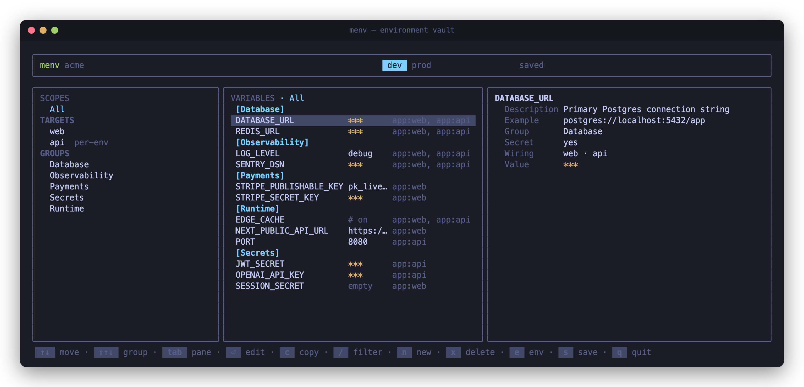

<div align="center">

# menv

**A keyboard-driven TUI — and a full CLI — for managing environment variables
across a monorepo. Values age-encrypted in one vault, `.env` files generated on
demand.**



<sub>Runtime: <b>Bun</b> · UI: <b>Ink + React</b> · Encryption: <b>age</b></sub>

</div>

---

`menv` discovers every `.env` file in your repo, lifts the
values into a single **age-encrypted vault**, and lets you edit, group, and
**wire** variables to the apps that consume them — from a fast keyboard-driven
TUI or, just as fully, from the command line. The encrypted vault is committed;
the plaintext `.env` files are regenerated on demand and stay git-ignored.

No more "which `.env` has the real `STRIPE_SECRET_KEY`?", no more pasting secrets
into Slack, no more `.env.example` drift.

## Why

A monorepo spreads the same handful of secrets across a dozen `.env` files. Keeping
them in sync — and out of git — is tedious and error-prone. `menv` makes the repo
the **single source of truth**:

- **One encrypted vault, many `.env` files.** Values live once, age-encrypted under
  `.menv/values/`. Each app's `.env` is *generated* from the vault, never hand-edited.
- **Grouped by value, not by ceremony.** When several apps already share a value,
  `menv init` collapses them into a single variable wired to all of them; apps
  that disagree keep their own. No global/local bookkeeping to maintain.
- **Wiring, not copy-paste.** Decide which apps (and the repo root) receive a
  variable; `menv` writes it into exactly those `.env` files.
- **Commit the secrets, safely.** The vault is ciphertext. Only the holder of the
  age identity can read it — and you choose where that identity lives.
- **`.env.example` for free.** Regenerated as a committed, values-free template so
  new contributors know what to set.

## Quick start

`menv` runs on [Bun](https://bun.sh) — TypeScript/TSX execute directly, no build step.

```bash
bun install      # install dependencies
bun link         # put `menv` on your PATH (optional)
```

Then, from the root of your repo:

```bash
menv init        # scan the repo, create the vault, update .gitignore
menv             # launch the TUI
```

`menv init` walks your workspace, finds every `.env*` file, encrypts the
discovered values, and asks where to keep the secret key
(see [Key backends](#key-backends)). Run `menv` with no arguments any time to open
the editor.

It also offers to scaffold the **menv-usage agent skill** into
`.claude/skills/menv-usage/SKILL.md` — a short guide that teaches an AI coding
agent how to work in a menv repo (the vault is the source of truth, never
hand-edit a generated `.env`, pipe secrets on stdin, …). On a TTY you're asked;
pass `--with-skill` or `--no-skill` to decide non-interactively (headless runs skip
it). An existing skill file is left untouched — delete it first to refresh.

> Prefer a single binary? `bun run build` compiles a standalone `./menv`.

## The TUI

Three panes, driven entirely from the keyboard:

| Pane | What it shows |
|------|---------------|
| **Scopes** | `All`, then your **targets** (each app, plus the repo root) and variable **groups**. Selecting one filters the list; a per-env target is tagged `per-env`. |
| **Variables** | The variables in the current scope, grouped and name-sorted. Secrets render as `***`; unset values show `empty`. A variable wired but **not applied** in the active environment shows its value dimmed and commented (`# value`). |
| **Inspector** | Every field of the selected variable — description, example, group, secret flag, **wiring** (a target reads `(off)` where the variable isn't applied in the active environment), and the value for the active environment. |

The top bar shows the repo, the **environment tabs** (the active one highlighted),
and an unsaved-changes indicator (`* N unsaved` / `saved`).

### Keybindings

| Key | Action |
|-----|--------|
| `↑` `↓` | Move within the focused pane (scope · variable · inspector field) |
| `⇧↑` `⇧↓` *(or `⌥↑` `⌥↓`)* | Jump between group blocks in the variable list |
| `Tab` | Cycle panes: scopes → variables → inspector |
| `Esc` | From the inspector, back to the variable list |
| `Enter` | Edit the focused value / field — or toggle **secret**, or open the **wire** modal (inside it, `Enter` wires/unwires a target and `a` toggles whether the variable is **applied** in the active environment). Editing a value shared by other environments offers to update them too (default **No**). |
| `c` | Copy the value (or field) to the clipboard |
| `e` | Switch environment (`dev` → `prod` → …) |
| `m` | On an app scope, toggle its **file mode** (single `.env` ↔ per-env `.env.<env>`) |
| `/` | Filter variables by name |
| `n` | New variable |
| `x` | Delete the selected variable |
| `s` | Save — encrypt the vault and regenerate every `.env` / `.env.example` |
| `q` *(or `Ctrl+C`)* | Quit — prompts to save if there are unsaved changes |

## Concepts

- **Environments** — `dev`, `prod`, `staging`, … Every variable can hold a distinct
  value per environment. The active environment (top bar, switch with `e`) decides
  which value is written into the generated `.env` files.
- **File modes** — Each consumer is either **single** (one `.env`, the default — it
  holds the active environment's values) or **per-env** (one `.env.<env>` file per
  environment, side by side). `menv init` picks **per-env** automatically for any
  consumer that already has `.env.<env>` files (e.g. `.env.production`); everything
  else stays single. Toggle it later with `m` in the TUI or `menv mode <consumer>
  <single|perenv>`. A per-env consumer only gets a file for the environments it
  actually has values in — so `menv` round-trips exactly the `.env.<env>` files that
  existed, not one for every global environment.
- **Grouping by value** — `menv init` decides what's one variable by *value*, not by
  tier. When several apps define the same name with the same value, they collapse
  into a single variable wired to all of them; where the values differ, each value
  becomes its own variable of the same name (disambiguate the duplicates with
  `--scope`). There is no global/local distinction to track.
- **Local overrides** — A key found in a `.env.local` (or `.env.<env>.local`) file
  becomes its own variable tagged `(local)` in the TUI. It edits and wires like any
  other, but generates back into the matching `.local` file rather than the base
  `.env` — and is kept out of the shared `.env.example` template. An app with both
  `.env` and `.env.local` stays **single** mode; only an explicit `.env.<env>` flips
  it to per-env.
- **Wiring vs. applied** — **Wiring** is which **consumers** receive a variable: any
  number of apps, plus the synthetic `root` target (the repo's top-level `.env`).
  Independently, a wired variable is either **applied** in a given consumer +
  environment — written as a live `KEY=value` line — or not, in which case it is
  still written but **commented out** (`# KEY=value`), staying visible as a
  known-but-inactive variable. `menv init` and drift sync infer this from what's
  actually present in each file: a key in `.env.development` but missing from (or
  commented in) `.env.production` comes back wired to that target yet *unapplied* in
  `prod`. `.env.example` documents the full surface but doesn't count as "present",
  so a key that appears only there stays wired (it keeps its slot in the template)
  yet *unapplied* — commented — in the real env files it was never set in. Toggle it
  per environment with `a` in the wire modal. (A variable's
  *value* for an environment is shared across every consumer it's wired to; only the
  applied/commented state is per consumer.)
- **Drift reconciliation** — Generated `.env` files are meant to be rewritten from
  the vault, but people edit them by hand. When you open the TUI, `menv` first
  compares every generated file against the vault and, if any diverge, walks you
  through them one at a time: import the on-disk edits back into the vault (changed
  values update in place; brand-new keys become new variables; a key you **deleted
  or commented out** becomes *unapplied* — it returns commented, not removed, and
  uncommenting one re-applies it) or keep the vault and let the next save overwrite
  the file. Removing a variable outright stays an explicit `unwire` / `x` action.
  (`menv generate` stays a one-way vault→disk regenerate for CI.)
- **Secrets** — Flagged variables are masked (`***`) in the UI. The flag is
  auto-detected from the name on `init` (`SECRET`, `TOKEN`, `KEY`, `PASSWORD`,
  `DSN`, `URL`) and toggleable per variable.
- **Groups** — An optional label (`Database`, `Payments`, …) that buckets variables
  in the list and adds a scope in the sidebar.

## Working from the CLI

Everything the inspector does is also a command, so you can manage the vault from
scripts, CI, or over SSH without opening the TUI. The commands split cleanly:
**`define`** shapes a variable (metadata + wiring) in the manifest, while
**`set`** writes its value.

```bash
# Create a secret and wire it to two apps and the repo root
menv define STRIPE_KEY --secret --description "Stripe API key" --scope web,worker,root

# Set its value — from an argument, a pipe, or a hidden prompt if you omit it
printf '%s' "$KEY" | menv set STRIPE_KEY        # stdin keeps it out of shell history
menv set PORT 3000 --env prod                   # a specific environment

menv get STRIPE_KEY                             # raw value to stdout — pipeable
menv list --scope web                           # what `web` receives (secrets masked)
menv list --json                                # machine-readable, full records

menv wire   STRIPE_KEY api                       # also deliver it to `api`
menv unwire STRIPE_KEY worker                    # stop delivering it to `worker`
menv rm OLD_FLAG                                 # remove a variable entirely

menv mode api perenv                             # api emits .env.<env> files
menv mode web single                             # web emits a single .env

# Local overrides: --local creates/addresses the .env.local variant of a name
menv define API_URL --local --scope web          # a separate override variable
menv set    API_URL --local http://localhost     # set the override's value
menv get    API_URL                              # the base value (.env)
menv get    API_URL --local                      # the override value (.env.local)
```

A few things worth knowing:

- **Values never need to touch your shell history.** Pipe them on stdin, or omit
  the argument entirely and `menv set` prompts (masked) on a TTY.
- **`get` prints the real value** — secrets included — so `export TOKEN=$(menv get TOKEN)`
  just works. (`list` masks secrets as `***`.)
- **Wiring materializes the target.** Wire a variable to an app that had no `.env`
  yet and `menv` starts generating one for it; `root` writes a top-level `.env`.
- **Every mutating command re-encrypts the vault and regenerates the affected
  `.env` / `.env.example` files** — exactly like pressing `s` in the TUI.
- **Repeated names** (same variable name, different values) are addressed with
  `--scope <consumer>`; without it, an ambiguous name is reported rather than guessed.
- **Local overrides** are a separate variable behind `--local` (on `define`, `set`,
  `get`, `rm`, `wire`/`unwire`, and as a `list` filter). Without the flag a command
  addresses the base variable (`.env` is canonical); `--local` targets the
  `.env.local` override, which generates into the matching `.local` file and is kept
  out of `.env.example`.

The full grammar is in the [CLI reference](#cli-reference).

## Key backends

The vault is encrypted to an **age** recipient (a public key, recorded in
`menv.toml`). Decryption needs the matching **identity** (the private key). Where
that identity lives is your choice at `menv init` — `--backend keychain|1password|password`,
or pick interactively:

| Backend | Where the identity lives | Portability | Trade-off |
|---------|--------------------------|-------------|-----------|
| `keychain` *(macOS)* | macOS login Keychain | This machine / Keychain sync | Most seamless, but macOS-only. |
| `1password` | A 1Password item (via the `op` CLI); only an `op://…` reference is stored in `menv.toml` | Any machine signed in to the vault | Great for teams; requires `op`. |
| `password` | A passphrase-encrypted `.menv/identity.age`, **committed to the repo** | Anywhere — travels with the repo | Fully portable, but the passphrase is the *only* barrier: anyone with repo access **and** the passphrase can decrypt the vault. |

The `password` backend reads its passphrase interactively, or from
`MENV_PASSPHRASE` for headless use.

## CLI reference

```text
menv [command] [options]

  (none)                  Launch the interactive TUI (default)

  init [options]          Scan the repo, set up the vault, update .gitignore
      --backend <kind>      keychain | 1password | password
                            (omit to choose interactively)
      --vault <name>        1Password vault for the new item (default: Private)
      --with-skill          Scaffold the menv-usage agent skill into
      --no-skill            .claude/skills/ — or skip it (omit to be asked on a
                            TTY; an existing skill file is never overwritten)

  Variables — the same operations as the TUI inspector, headless:

  define NAME [options]   Create or update a variable's definition and wiring
      --secret | --no-secret   Mark / unmark as a secret
      --description <text>     Set the description
      --example <text>         Set the .env.example placeholder
      --group <name>           Set the group ("" clears it)
      --scope <c1,c2,…>        Replace its wiring; "root" = the repo-root .env
      --local                  Create/address the .env.local override of NAME
  set NAME [value]        Set a value — from the arg, stdin, or a hidden prompt
      --env <env>              Target environment (default: the default env)
      --scope <consumer>       Disambiguate a name shared by several variables
      --local                  Target the .env.local override
  get NAME [options]      Print a value to stdout (raw; secrets included)
      --env <env>, --scope <consumer>, --local
  list [options]          List variables (secrets shown as ***, unset as empty;
                          overrides tagged "(local)")
      --scope <consumer>, --group <name>, --env <env>, --local, --json
  wire   NAME <c1,c2,…>   Wire a variable to consumers (apps and/or "root")
      --local                  Wire the .env.local override
  unwire NAME <c1,c2,…>   Unwire a variable from consumers (--local for the override)
  rm NAME [options]       Delete a variable (--scope <c>, --local)
  mode <consumer> <m>     Set a consumer's .env layout: single | perenv

  Without --local, variable commands address the base variable; --local targets
  its .env.local override (a separate variable generated into the .local file).

  Materialize & back up:

  generate [--env <env>]  Regenerate .env files from the vault (headless / CI).
                          The password backend reads MENV_PASSPHRASE.
  backup                  Snapshot every .env and .env.example into
                          .menv/backups/<timestamp>
  restore [key] [-f]      Restore .env / .env.example files from a backup.
                            key            a backup timestamp (omit to pick one)
                            -f, --force    overwrite every file without prompting

  -h, --help              Show help
  -v, --version           Show the version
```

`define`, `set`, `wire`/`unwire`, and `rm` each re-encrypt the vault and regenerate
the affected `.env` files. `define`/`set` (with the `password` backend) read
`MENV_PASSPHRASE` for headless use, just like `generate`.

## On-disk layout

```text
your-repo/
├─ menv.toml                 # committed — envs, recipients, apps, [key_backend]
├─ .menv/
│  ├─ manifest.toml          # committed — variable definitions (name, group, secret, wiring…)
│  ├─ identity.age           # committed — ONLY for the `password` backend (encrypted key)
│  ├─ values/
│  │  ├─ dev.env.age         # git-ignored — age-encrypted values for `dev`
│  │  └─ prod.env.age        # git-ignored — …one file per environment
│  └─ backups/               # git-ignored — timestamped .env snapshots
├─ apps/web/                 # single mode (default)
│  ├─ .env                   # git-ignored — generated for the active environment
│  ├─ .env.local             # git-ignored — local overrides, if any (kept out of .env.example)
│  └─ .env.example           # committed — values-free template
└─ apps/api/                 # per-env mode
   ├─ .env.dev               # git-ignored — one file per environment it has values in
   ├─ .env.prod              # git-ignored
   └─ .env.example           # committed — values-free template
```

`menv init` appends this block to `.gitignore`:

```gitignore
# menv
.menv/values/
.menv/backups/
.env
.env.*
!.env.example
```

The encrypted vault (`menv.toml`, `.menv/manifest.toml`, `.menv/values/*.age`) is
safe to commit; the plaintext `.env` files are not, and are regenerated on demand.

> **Note:** values are treated as single-line. A multi-line value (e.g. a PEM key
> spanning several lines) isn't supported yet — keep such values on one line
> (escaped `\n`) or out of the vault.

## Headless / CI

Materialize `.env` files on a build machine without the TUI:

```bash
# keychain / 1password backends use the ambient credential
menv generate --env prod

# password backend: supply the passphrase out-of-band
MENV_PASSPHRASE='…' menv generate --env prod
```

`menv generate` decrypts the vault and writes each app's `.env` (plus refreshed
`.env.example` templates). `--env` selects which environment lands in a
single-mode app's `.env`; per-env apps always get all their `.env.<env>` files.

## Development

```bash
bun install            # install deps
bun run menv           # run the CLI from source (src/index.ts)
bun test               # run the test suite (bun:test)
bun run build          # compile a standalone ./menv binary
```

Source is organized by responsibility — domain logic stays free of filesystem and
crypto side-effects:

```text
src/
├─ cli/      # command handlers: init, define, set, get, list, wire, mode, rm, generate, backup, restore
├─ core/     # domain model and types
├─ crypto/   # age encryption, identities, key backends, the vault
├─ io/       # discovery, dotenv parsing, persistence, generation
├─ store/    # in-memory store, load/save
└─ ui/       # Ink components, app.tsx, scopes & grouping
tests/       # mirrors src/ one-to-one
```

## Security model

- Values are encrypted with **age** to a recipient public key in `menv.toml`.
  Reading the vault requires the private identity from your chosen backend.
- With `keychain` / `1password`, the identity never lands in the repo.
- With `password`, the encrypted identity is committed for portability — so the
  **passphrase is the whole barrier**. Choose a strong one, and treat repo access
  plus passphrase as equivalent to full vault access.
- Generated `.env` files and the decrypted `.menv/values/` are git-ignored by
  default; keep them that way.
